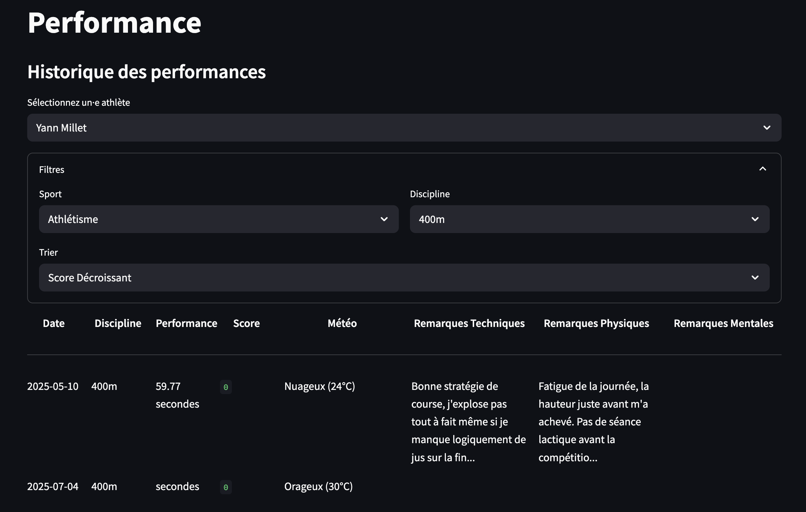

# OpenAMS

**OpenAMS** is a personal web application meant to store/display/manage/analyze all aspects of an athlete's journey (training, performance, health, sleep, nutrition, ...).  
This is a **personal project** to organize my own practice, but most importantly a platform where I can collect and experiment Sport Data Science on my own data, which is why the web app in itself isn't sometimes optimally coded.

> ⚠️ This app is intended for **personal use only**, that's why there is **no user authentication**, **no data security**, and **no multi-user system**. It's not designed for deployment or public access. Keep that in mind if you want to use as well.

---

## Features Overview

Here is an overview of the current features.

### User Page

Everything related to user (athlete or coach) entities:

- Create new users (athlete or coach role)
- Assign one sport to each user
- Edit existing user information (there are still some bugs here, precisely in the gender modification that are not taken into account)
- Delete users

---


---


---

### Training Management Page

Keep track of all training sessions, linked to one or more athletes.

- Create a training session with:
  - Date
  - Type (e.g., "Throws", "Sprint")
  - Sport (e.g., "Athlétisme")
  - Duration (in minutes)
  - Intensity (scale 1–10)
  - Notes
- Assign the session to one or more athletes
- Assign the session to one or none coach
- View and filter past training sessions with:
  - Sport
  - Training type
  - Intensity range
  - Duration range
  - Date range
  - Sort by most recent / most intense / longest duration
- Paginated display

---


---


---


---

### Performance Lab Page

Keep track of performances in each sport and discipline.

- Select a sport and discipline (e.g., "Athlétisme" → "100m")
- Compute decathlon score (get the score of an athletics performance without adding a performance in the database).
- Add a performance with:
  - Date
  - Result (mark)
  - Unit (centimeters, seconds, points)
  - Weather conditions
  - Temperature (°C)
  - Technical cues
  - Physical cues
  - Mental cues

For athletics, the score of the performance is calculated according to the IAAF formulaes. It is also possible to sort performances by score (increasing or decreasing).
---


---



---

### Health Page

Keep a daily morning health check (one entry per day, can't submit more than once for a date).

- Add a daily update:

  - muscle soreness
  - sleep quality
  - energy level
  - mood
  - resting heart rate
  - grip strength test (recovery approximate)
  - longest expiration test (recovery approximate)
  - additional notes

- View of the last 7 days of daily checks


---


---

Future improvements:

- customizable graphs and plots in dashboard display to better explore data (instead of last 7 days display)
- ticket opening to track specific pain/injury (open an injury, add daily update about it, be able to close it if resolved)
- view pain/injuries evolution with plots and graphs, sort them

## Setup Instructions

```bash
conda env create -f environment.yml
conda activate openams
```

## Running the app

### Backend (FastAPI + SQLModel)

The database (SQLite) and API logic.

Go in the main folder of the project and run:

```bash
uvicorn backend.main:app --reload
```

Or go in the `backend` folder and run:

```bash
uvicorn main:app --reload
```

It will run on `http://127.0.0.1:8000`

### Frontend (Streamlit)

The user interface.

Go in the main folder of the project and run:

```bash
streamlit run frontend/app.py
```

Or go in the `frontend` folder of the project and run:

```bash
streamlit run app.py
```

## Tech Stack

As I'm mainly a Python programmer, this tech stack was the easiest way for me to get a functional project as soon as possible.

**Frontend:** Streamlit (Python)
**Backend:** FastAPI, SQLModel (SQLAlchemy + Pydantic)
**Database:** SQLite
**Dev tools:** Uvicorn, Conda/Pip

## Next improvements

Features that I would like to implement in the future:

Some improvements:

- Layout of frontend: better color palette, display in blocks more than just all sections one after the other.
- Fix bugs.
- Add Personal Best calculation in the performance display (PB and FilterPB to know what is the PB and what is the PB in the conditions set through the filters).

Bigger features:

- Health section: connected watch API to gather more complex data, track injuries (open a ticket when it occurs and add news on it regularly).
- Analytics section: data analysis of every data collected in the app: draw evolutions, compare periods of time of an athlete.
- Nutrition: Yazio API (if it exists).
- Calendar: schedule meetings/competitions/games to anticipate the work load + get reminders.
- Data Science section (the initial purpose motivating this project): use the collected data to predict metrics (injuries, workload, recovery, performances, explaining factors).

## Code structure

openams/\
├─── backend/\
│ ├─── data _(not pushed, the code will create/load yours on startup)_
│ │ └── database.db
│ ├─── models/\
│ │ ├── \_\_init\_\_.py\
│ │ ├── enumeration.py\
│ │ ├── performance.py\
│ │ ├── training.py\
│ │ └── user.py\
│ ├─── \_\_init\_\_.py\
│ ├─── database.py\
│ ├─── db*modif_dev.py\ *(dev code meant to update a db table when I add a field without deleting and recreating everything, can be useful if you modify the project. Run in in the main folder of the project)\_
│ ├─── main.py\
├─── frontend/\
│ ├─── \_\_init\_\_.py\
│ ├─── app.py\
│ ├─── helpers.py\
│ ├─── performance_tab.py\
│ ├─── training_tab.py\
│ └─── user_tab.py\
├─── illus/\
│ └─── illustrations_of_readme.png\
├─── requirements.txt\
├─── requirements.yml\
└─── README.md\
